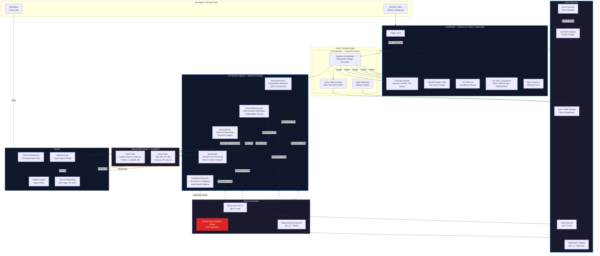

<p align="center">
  
  
  
  
</p>

# DevSecOps Guardian

**Enterprise-grade multi-agent AI security platform for banking and regulated industries.**

Five specialized AI agents — **registered and running in Azure AI Foundry** — replace traditional SAST tools (SonarQube, Checkmarx, Fortify) with LLM-powered reasoning. From vulnerability detection through auto-fix PRs to PCI-DSS 4.0 compliance reports, fully automated with **AI safety guardrails** applied to every agent interaction.

<p align="center">
  <a href="https://ca-dashboard.agreeablesand-6566841b.eastus.azurecontainerapps.io">Live Demo</a> &bull;
  <a href="#architecture-diagram">Architecture</a> &bull;
  <a href="#how-it-works---foundry-agent-pipeline">How It Works</a> &bull;
  <a href="#agents-in-foundry">Agents</a> &bull;
  <a href="#quick-start">Quick Start</a>
</p>

---

## The Problem

Banks and financial institutions face a critical gap in application security:

- **Traditional SAST tools** rely on regex/pattern matching — they generate 60-80% false positives
- **No contextual reasoning** — tools flag `bcrypt` hashing as "weak crypto" without understanding it's the right choice
- **No compliance automation** — security teams manually map CWEs to PCI-DSS controls for every audit
- **No integrated fix generation** — developers receive findings but must research and implement fixes themselves
- **No AI safety** — LLM-based tools have no guardrails against prompt injection or harmful content generation

## The Solution

DevSecOps Guardian is a **multi-agent AI pipeline** where each agent is **registered in Azure AI Foundry** with safety guardrails, and invoked via the **Responses API**. Every agent interaction is tracked with telemetry in **Application Insights**:

```
Code Push --> SecurityScanner --> VulnerabilityAnalyzer --> SecurityFixer --> RiskProfiler --> ComplianceReporter
                  |                      |                      |                |                  |
                  |                      |                      |                |                  +-- PCI-DSS 4.0 report
                  |                      |                      |                +-- OWASP Top 10 risk score
                  |                      |                      +-- Draft PRs with fixes
                  |                      +-- False positive elimination (0-100)
                  +-- AI-detected vulnerabilities (CWE-classified)

              All calls route through Azure AI Foundry Responses API
              DevSecOps-Guardian-Safety guardrails applied to every interaction
              gen_ai.* telemetry captured in Application Insights
```

---

## Architecture Diagram



---

## Hero Technologies

### 1. Microsoft Foundry Agent Service (Primary)

All 5 security agents are **registered in Azure AI Foundry** as `prompt`-kind agents using the `azure-ai-projects` v2 SDK. In production, **every LLM call routes through Foundry's Responses API** — not direct Azure OpenAI. This means:

- **Guardrails are enforced** on every agent interaction (`DevSecOps-Guardian-Safety` RAI policy)
- **Telemetry is captured** automatically via `ResponsesInstrumentor` (gen_ai.* OpenTelemetry spans)
- **Agents are visible** in the Foundry portal's Agents section with full interaction history
- **Evaluations apply** to production traffic for quality monitoring

```python
# Production call path (agents/*/llm_engine.py)
from azure.ai.projects import AIProjectClient
from azure.identity import DefaultAzureCredential

project = AIProjectClient(endpoint=FOUNDRY_ENDPOINT, credential=DefaultAzureCredential())
openai_client = project.get_openai_client()

# Routes through Foundry → guardrails applied → telemetry captured
response = openai_client.responses.create(
    model="gpt-4.1-mini",
    instructions=system_prompt,        # Agent-specific security expertise
    input=[{"role": "user", "content": user_prompt}],
    text={"format": {"type": "json_object"}},
)
```

| Implementation | File |
|----------------|------|
| Agent registration | `agents/register_all_agents.py` |
| Scanner LLM engine | `agents/scanner/llm_engine.py` |
| Analyzer LLM engine | `agents/analyzer/llm_engine.py` |
| Fixer LLM engine | `agents/fixer/llm_engine.py` |
| Risk Profiler LLM engine | `agents/risk-profiler/llm_engine.py` |
| Compliance LLM engine | `agents/compliance/llm_engine.py` |

### 2. OpenTelemetry + Application Insights (Observability)

Every agent has built-in tracing that captures **gen_ai.* spans** for full observability:

```python
# Automatic telemetry setup in each agent (agents/*/llm_engine.py)
from opentelemetry.instrumentation.openai import ResponsesInstrumentor
from azure.monitor.opentelemetry.exporter import AzureMonitorTraceExporter

# Patches openai.responses.create() to emit gen_ai.* spans
ResponsesInstrumentor().instrument(enable_content_recording=True)

# Spans exported to Application Insights → visible in Foundry Operate tab
provider.add_span_processor(SimpleSpanProcessor(AzureMonitorTraceExporter(...)))
```

This provides:
- **Foundry Operate tab**: See every agent interaction with latency, tokens, and content
- **Application Insights**: Query gen_ai spans, set alerts, track cost
- **End-to-end tracing**: Full pipeline visibility from scan trigger to compliance report

### 3. Azure MCP Server (Tool Integration)

Custom GitHub MCP Server with **9 tools** built with **FastMCP**, registered as native `MCPTool` in Foundry:

| Tool Category | Tools | Used By |
|---------------|-------|---------|
| **Read** | `github_read_file`, `github_list_files`, `github_read_pr_diff`, `github_list_pr_files`, `github_get_pr` | Scanner, Analyzer |
| **Write** | `github_create_branch`, `github_create_or_update_file`, `github_create_pr`, `github_post_pr_comment` | Fixer |

### 4. GitHub Copilot Agent Mode (Remediation)

When the Fixer agent creates PRs, it also creates **formatted GitHub Issues** that GitHub Copilot Coding Agent picks up for enhanced remediation:

```
Fixer Agent → Draft PR + GitHub Issue → Copilot Coding Agent → Enhanced Fix → Human Review → Merge
```

---

## How It Works — Foundry Agent Pipeline

```
  User clicks "Scan" in Dashboard
         |
         v
  +------------------+
  | API Gateway      |  FastAPI on Azure Container Apps
  | POST /api/scans  |
  +--------+---------+
           |
           | Orchestrates 5 stages sequentially
           |
  +--------v---------+     Foundry Responses API
  | SecurityScanner  | --> openai_client.responses.create(model="gpt-4.1-mini", ...)
  | (llm_engine.py)  |     + DevSecOps-Guardian-Safety guardrails
  +--------+---------+     + ResponsesInstrumentor → App Insights
           | scanner-output.json (CWE findings)
           |
  +--------v-----------------+
  | VulnerabilityAnalyzer    | --> Same Foundry Responses API path
  | Reads findings + source  |     Contextual false positive elimination
  +--------+-----------------+
           | analyzer-output.json (CONFIRMED / FALSE_POSITIVE verdicts)
           |  ↓ Re-scan comparison computed here (NEW / RESOLVED / PERSISTENT)
           |
  +--------v---------+
  | SecurityFixer    | --> Foundry Responses API + GitHub API
  | Generates fixes  |     Creates branches, commits, draft PRs
  +--------+---------+
           | fixer-output.json (fix status per finding)
           |
  +--------v---------+
  | RiskProfiler     | --> Foundry Responses API
  | OWASP Top 10     |     Holistic risk assessment
  +--------+---------+
           | risk-profile-output.json
           |
  +--------v-----------------+
  | ComplianceReporter       | --> Foundry Responses API
  | PCI-DSS 4.0 mapping     |     Audit-ready compliance report
  +--------+-----------------+
           | compliance-output.json
           |
           v
  Dashboard displays results with full evidence trail
  (Findings, Risk Radar, Compliance, Comparison Report, Best Practices)
```

**Key point**: Every LLM call in production goes through `project.get_openai_client().responses.create()`, which routes through the **Foundry endpoint**. The agents registered in Foundry (SecurityScanner:2, VulnerabilityAnalyzer:2, etc.) have the `DevSecOps-Guardian-Safety` RAI policy applied, ensuring guardrails are enforced on all agent interactions. The `ResponsesInstrumentor` captures gen_ai.* spans that appear in both Application Insights and the Foundry Operate tab.

---

## Agents in Foundry

All 5 agents are registered in Azure AI Foundry under the project `devsecops-guardian-hackaton-etech`:

| Agent | Kind | Model | Guardrails | Purpose |
|-------|------|-------|------------|---------|
| **SecurityScanner:2** | `prompt` | `gpt-4.1-mini` | DevSecOps-Guardian-Safety | LLM-based code vulnerability detection |
| **VulnerabilityAnalyzer:2** | `prompt` | `gpt-4.1-mini` | DevSecOps-Guardian-Safety | Contextual false positive elimination |
| **SecurityFixer:2** | `prompt` | `gpt-4.1-mini` | DevSecOps-Guardian-Safety | Automated code fix generation |
| **RiskProfiler:2** | `prompt` | `gpt-4.1-mini` | DevSecOps-Guardian-Safety | OWASP Top 10 risk assessment |
| **ComplianceReporter:2** | `prompt` | `gpt-4.1-mini` | DevSecOps-Guardian-Safety | PCI-DSS 4.0 compliance auditing |

**Foundry Endpoint**: `https://devsecops-guardian-hackaton-etec.services.ai.azure.com`

Each agent has:
- **Expert system prompt** — Domain-specific security expertise (AppSec engineer, compliance auditor, etc.)
- **JSON-structured output** — Machine-parseable results for pipeline chaining
- **RAI guardrails** — `DevSecOps-Guardian-Safety` policy prevents prompt injection and harmful content
- **Telemetry** — All interactions visible in Foundry Operate tab via ResponsesInstrumentor

---

## Dashboard Features

The Next.js dashboard provides a rich, real-time interface for security teams:

| Feature | Description |
|---------|-------------|
| **Scan Management** | Trigger scans, cancel running scans, retry failed scans, delete old scans |
| **Real-Time Pipeline** | Live pipeline progress bar showing each agent stage |
| **Findings Explorer** | Filter by severity (CRITICAL/HIGH/MEDIUM/LOW), verdict (CONFIRMED/FALSE_POSITIVE), fix status |
| **Vulnerability Detail** | Code context, analysis reasoning, attack scenarios, fixed code preview |
| **OWASP Risk Radar** | Interactive radar chart with per-category risk scores and attack surface breakdown |
| **Risk Score Gauge** | Visual gauge showing overall risk level (0-100) |
| **PCI-DSS Compliance** | Requirement-by-requirement compliance mapping with evidence and remediation status |
| **Re-Scan Comparison** | Side-by-side comparison between scans — NEW, RESOLVED, PERSISTENT findings with charts |
| **Best Practices** | Maturity score, violations vs. followed practices, anti-pattern detection |
| **Scan History** | Full re-scan chain tracking across multiple scans |

---

## Azure Services

| Service | Purpose |
|---------|---------|
| **Azure AI Foundry** | Agent registration, Responses API routing, guardrails enforcement, Operate tab monitoring |
| **Azure OpenAI** | gpt-4.1-mini inference for all 5 agents (routed via Foundry) |
| **Application Insights** | gen_ai.* telemetry from ResponsesInstrumentor, pipeline monitoring |
| **Azure Container Apps** | Serverless hosting for API Gateway + Dashboard (auto-scaling) |
| **Azure Container Registry** | Cloud Docker builds and image storage |
| **Azure Table Storage** | Persistent scan records, stage outputs, and comparison data |
| **Azure DevOps Pipelines** | CI/CD with 8-stage pipeline (lint, test, build, push, deploy) |

---

## Results

| Metric | Value |
|--------|-------|
| **Vulnerabilities planted** | 52 across 14 route files (50 real + 2 false positives) |
| **CWE categories covered** | 30+ distinct CWE types |
| **Detection rate** | 95%+ of planted vulnerabilities detected |
| **False positive elimination** | Analyzer correctly identifies safe patterns (parameterized SQL, bcrypt) |
| **Auto-fix PRs generated** | 25+ draft PRs merged with security fixes |
| **Compliance report** | PCI-DSS 4.0 audit-ready in seconds (vs. 2-3 weeks manual) |
| **Risk profiling** | OWASP Top 10 scoring with per-category breakdown |
| **Re-scan comparison** | Automatic NEW/RESOLVED/PERSISTENT classification between scans |
| **Guardrails** | DevSecOps-Guardian-Safety applied to 100% of agent interactions |
| **Telemetry** | Full gen_ai.* spans in App Insights for every scan |

---

## Demo App — 52 Vulnerabilities

A vulnerable Node.js/Express banking API (`demo-app/`) with **52 intentionally planted vulnerabilities** across 14 route files:

### Original Attack Surface (Vulns #1-42)

| File | Vulnerabilities | CWEs |
|------|----------------|------|
| `accounts.js` | SQL Injection | CWE-89 |
| `search.js` | Reflected XSS | CWE-79 |
| `users.js` | Missing Auth on DELETE | CWE-862 |
| `transfers.js` | IDOR | CWE-639 |
| `balance.js` | Parameterized SQL (FALSE POSITIVE) | CWE-89 |
| `documents.js` | Path Traversal / LFI | CWE-22 |
| `webhooks.js` | SSRF | CWE-918 |
| `settings.js` | Prototype Pollution | CWE-1321 |
| `export.js` | RCE via Deserialization | CWE-502 |
| `admin.js` | Mass Assignment, Debug Endpoint, Privilege Escalation, Bulk Export | CWE-915, 489, 269, 770 |
| `payments.js` | Race Condition, Insecure Randomness, No Validation, Cleartext Logging | CWE-367, 330, 20, 312 |
| `uploads.js` | Unrestricted Upload, MIME Confusion, XXE, Open Redirect, Shell Injection | CWE-434, 436, 611, 601, 78 |
| `notifications.js` | Template Injection, ReDoS, Insecure Cookies, Stack Trace Leak, Header Injection | CWE-1336, 1333, 614, 209, 113 |
| `reports.js` | 2nd-Order SQLi, Weak Crypto MD5, Hardcoded Creds, Insecure HTTP | CWE-89, 328, 798, 319 |

### New Attack Surface (Vulns #43-52)

| # | Vulnerability | File | CWE |
|---|--------------|------|-----|
| 43 | Horizontal IDOR — access any user's profile | `profile.js` | CWE-639 |
| 44 | Weak Password Hashing — MD5 without salt | `profile.js` | CWE-916 |
| 45 | Mass Data Exposure — SSN, salary, bank account returned | `profile.js` | CWE-200 |
| 46 | SQL Injection via dynamic JSON filter | `profile.js` | CWE-943 |
| 47 | Remote Code Execution via `eval()` | `profile.js` | CWE-95 |
| 48 | Command Injection via `execSync("ping " + host)` | `diagnostics.js` | CWE-78 |
| 49 | XML External Entity (XXE) Injection | `diagnostics.js` | CWE-611 |
| 50 | Log Forging / Log Injection | `diagnostics.js` | CWE-117 |
| 51 | Gzip Bomb — Uncontrolled Resource Consumption | `diagnostics.js` | CWE-400 |
| 52 | JWT None Algorithm + Hardcoded Secret | `diagnostics.js` | CWE-347 |

---

## API Endpoints

| Method | Endpoint | Description |
|--------|----------|-------------|
| `GET` | `/api/health` | Health check + agent availability |
| `POST` | `/api/scans` | Trigger new security scan (supports `parent_scan_id` for re-scans) |
| `GET` | `/api/scans` | List all scans with status |
| `GET` | `/api/scans/{id}` | Full scan detail with all agent outputs + comparison data |
| `DELETE` | `/api/scans/{id}` | Delete a scan record |
| `POST` | `/api/scans/{id}/cancel` | Cancel a running scan |
| `POST` | `/api/scans/{id}/retry` | Retry a failed scan with same configuration |
| `GET` | `/api/scans/{id}/findings` | Merged findings with verdicts + fix status |
| `GET` | `/api/scans/{id}/history` | Re-scan history chain |
| `GET` | `/api/scans/{id}/compliance` | PCI-DSS 4.0 compliance assessment |
| `GET` | `/api/scans/{id}/risk-profile` | OWASP Top 10 risk profile |
| `GET` | `/api/scans/{id}/practices` | Best practices analysis |

---

## Quick Start

### Prerequisites
- Python 3.12+
- Node.js 20+
- Docker & Docker Compose
- Azure OpenAI API key
- GitHub PAT (Contents R/W, Pull Requests R/W)

### Option 1: Docker Compose (Recommended)

```bash
git clone https://github.com/freddan58/devsecops-guardian.git
cd devsecops-guardian

export AZURE_OPENAI_ENDPOINT="your-endpoint"
export AZURE_OPENAI_API_KEY="your-key"
export GITHUB_TOKEN="your-github-pat"
export FOUNDRY_ENDPOINT="your-foundry-endpoint"

docker compose up --build
# Dashboard: http://localhost:3000
# API:       http://localhost:8000/api/health
```

### Option 2: Local Development

```bash
# API Gateway
cd api && pip install -r requirements.txt
cp .env.example .env  # Fill in credentials
uvicorn main:app --reload --port 8000

# Dashboard (separate terminal)
cd dashboard && npm install
echo "NEXT_PUBLIC_API_URL=http://localhost:8000" > .env.local
npm run dev
```

### Register Agents in Foundry

```bash
pip install "azure-ai-projects>=2.0.0b3" azure-identity
cd agents && python register_all_agents.py
```

---

## Competitive Differentiation

| Capability | GitHub CodeQL | Dependabot | **DevSecOps Guardian** |
|-----------|---------------|------------|------------------------|
| Detection method | Predefined rules | CVE database | **LLM reasoning over code context** |
| False positive handling | Manual tuning | N/A | **Dedicated AI agent (exploitability 0-100)** |
| Auto-fix | Limited languages | Version bumps | **Full code rewrites as draft PRs** |
| Risk profiling | No | No | **OWASP Top 10 risk score per service** |
| Compliance reporting | No | No | **PCI-DSS 4.0 audit-ready reports** |
| Re-scan comparison | No | No | **Automatic NEW/RESOLVED/PERSISTENT tracking** |
| Agent orchestration | Single tool | Single bot | **5 Foundry agents with guardrails** |
| AI safety | N/A | N/A | **DevSecOps-Guardian-Safety RAI policy** |
| Observability | Build logs | Alerts | **gen_ai.* spans in App Insights + Foundry Operate** |
| Copilot integration | N/A | N/A | **Auto-creates Issues for Copilot Agent** |

---

## Project Structure

```
devsecops-guardian/
|-- agents/
|   |-- scanner/              # Agent 1: LLM security scanner
|   |   |-- scanner.py        # File discovery + GitHub integration
|   |   |-- llm_engine.py     # Foundry Responses API + telemetry
|   |   +-- prompts.py        # Expert system prompt templates
|   |-- analyzer/             # Agent 2: False positive eliminator
|   |   +-- llm_engine.py     # Foundry Responses API + telemetry
|   |-- fixer/                # Agent 3: Auto-fix PR generator
|   |   |-- llm_engine.py     # Foundry Responses API + telemetry
|   |   +-- issue_creator.py  # GitHub Issues for Copilot Agent
|   |-- risk-profiler/        # Agent 4: OWASP risk profiler
|   |   +-- llm_engine.py     # Foundry Responses API + telemetry
|   |-- compliance/           # Agent 5: PCI-DSS compliance auditor
|   |   +-- llm_engine.py     # Foundry Responses API + telemetry
|   |-- register_all_agents.py # Register all 5 agents in Foundry
|   +-- orchestrator.py       # Agent Framework orchestration
|-- api/                      # FastAPI backend
|   |-- main.py               # App startup + orphan scan recovery
|   |-- pipeline.py           # 5-stage pipeline orchestrator + re-scan comparison
|   |-- models.py             # ScanRecord data model
|   |-- schemas.py            # Pydantic request/response schemas
|   |-- table_store.py        # Azure Table Storage persistence
|   +-- routers/              # REST API endpoints (scans, findings, compliance, risk)
|-- dashboard/                # Next.js 16 frontend
|   |-- app/scans/[id]/       # Scan detail, findings, risk, compliance, practices pages
|   +-- components/
|       |-- scans/            # PipelineStatus, ComparisonReport, NewScanDialog
|       |-- findings/         # SeverityBadge, StatusChangeBadge, VerdictBadge
|       +-- risk/             # OWASPRadarChart, RiskScoreGauge
|-- demo-app/                 # Vulnerable banking API (52 planted vulns)
|   +-- routes/               # 14 route files with CWE-classified vulnerabilities
|-- mcp-servers/
|   +-- github/               # GitHub MCP Server (9 tools, FastMCP)
|-- tests/                    # Feature verification suite
|-- scripts/                  # Utility scripts + evaluation datasets
|-- .github/
|   +-- copilot-instructions.md
|-- azure-pipelines.yml       # 8-stage CI/CD pipeline
+-- docker-compose.yml
```

---

## Tech Stack

| Layer | Technology |
|-------|-----------|
| **Agent Service** | Azure AI Foundry (`azure-ai-projects` v2 SDK, Responses API, `prompt` agents) |
| **AI Safety** | DevSecOps-Guardian-Safety RAI policy (guardrails on every agent call) |
| **Observability** | ResponsesInstrumentor + AzureMonitorTraceExporter (gen_ai.* spans) |
| **LLM** | Azure OpenAI `gpt-4.1-mini` (routed via Foundry) |
| **MCP** | Custom GitHub MCP Server (FastMCP, 9 tools) |
| **Copilot** | GitHub Copilot Agent Mode + Issue Creator |
| **API** | FastAPI, uvicorn, Pydantic |
| **Dashboard** | Next.js 16, React 19, TypeScript, Tailwind CSS 4, Recharts |
| **Infrastructure** | Azure Container Apps, Azure Container Registry, Azure Table Storage |
| **CI/CD** | Azure DevOps Pipelines (YAML, 8 stages) |

---

## Live Demo

- **Dashboard**: [https://ca-dashboard.agreeablesand-6566841b.eastus.azurecontainerapps.io](https://ca-dashboard.agreeablesand-6566841b.eastus.azurecontainerapps.io)
- **API Health**: [https://ca-api-gateway.agreeablesand-6566841b.eastus.azurecontainerapps.io/api/health](https://ca-api-gateway.agreeablesand-6566841b.eastus.azurecontainerapps.io/api/health)
- **Repository**: [https://github.com/freddan58/devsecops-guardian](https://github.com/freddan58/devsecops-guardian)

---

## Team

**Soluciones Etech Corp** — Freddy Urbano (furbano@soluetech.com)

---

## License

MIT

---

<p align="center">
  Built for <strong>Microsoft AI Dev Days Hackathon 2026</strong> — Agentic DevOps Track
</p>
